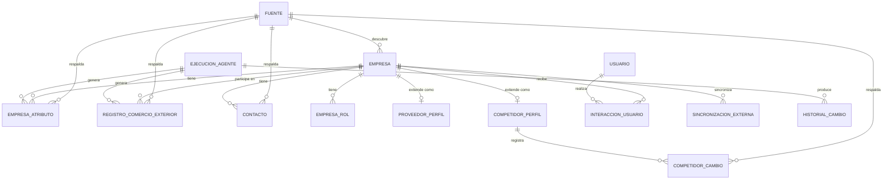

# Documento 005 — Modelo de Datos Empresarial

**Proyecto:** Loges-BIAP — Inteligencia Comercial y Logística, Grupo Gammacargo
**Versión:** 0.1
**Fecha:** Julio 2026

---

## 0. Contexto

Este documento formaliza en PostgreSQL (Documento 004) las entidades que el Documento 003 — Arquitectura Funcional mencionó de forma conceptual: empresa, comercio exterior, contacto, proveedor logístico, competidor, fuente, nivel de confianza e historial de actualización. No define aún la API (Documento 010) ni los permisos detallados por rol (Documento 011), pero sí las bases de datos que ambos van a necesitar.

Tres reglas de negocio del Documento 003 (sección 5) condicionan el diseño de todas las tablas:

1. "Ningún dato se presenta sin su fuente y nivel de confianza asociados" → todo hecho descubierto debe poder rastrearse a una fuente y una confianza.
2. "La información se actualiza de forma continua" → no hay cargas únicas; se necesita historial, no solo el estado actual.
3. "Todo dato descartado... debe excluirse de futuras sugerencias" → las decisiones del usuario sobre una empresa deben quedar registradas, no solo reflejadas como un borrado.

## 1. Principios de Diseño

- **Una empresa, varios roles.** La misma empresa puede ser, con el tiempo, un cargador candidato, un cliente ya ganado, un proveedor logístico evaluado o un competidor — no son tablas separadas de "tipos de empresa" sino roles asignables a una misma entidad `empresa`. Esto evita duplicar el mismo registro cuando el rol de una empresa cambia o se amplía, y sostiene la nota estratégica del Documento 001 (arquitectura desacoplada para un eventual licenciamiento).
- **Trazabilidad por hecho, no por tabla completa.** Cada tabla que representa un hallazgo (un embarque detectado, un contacto, un cambio de competidor) lleva su propia `fuente_id` y `nivel_confianza`, porque cada hallazgo normalmente proviene de una sola fuente en el momento en que se descubre. Para atributos de una empresa que varias fuentes pueden actualizar con el tiempo (ej. dirección, tamaño estimado), se usa una tabla de atributos versionados en vez de duplicar columnas de trazabilidad en la tabla `empresa` (ver sección 4).
- **Historial como registro append-only.** Nada se sobrescribe sin dejar rastro: toda actualización relevante también escribe una fila en `historial_cambio`.
- **Las decisiones del usuario son datos, no efectos secundarios.** "Contactar", "evaluar" o "descartar" una empresa se guarda como una fila en `interaccion_usuario`, para que el motor de agentes pueda excluir empresas descartadas de futuras sugerencias (regla 3 de esta sección).

## 2. Diagrama Entidad-Relación (resumen)

## 3. Catálogo de Entidades

### 3.1 `fuente`

Registra cada fuente pública utilizada, condición de entrada para todo lo demás (nada se guarda sin una fuente asociada).

| Campo | Tipo | Notas |
|---|---|---|
| id | uuid (PK) | |
| nombre | text | Ej. "Registro Nacional de Importadores — Costa Rica". |
| tipo | enum | `registro_mercantil`, `registro_aduanero`, `camara_comercio`, `estadistica_comercio_exterior`, `sitio_publico_corporativo`, `otro`. |
| pais | text | Código ISO de país. Determina qué regla del Documento 012-B aplica. |
| url_base | text | |
| nivel_confianza_base | enum | `ALTA` / `MEDIA` / `BAJA` — punto de partida antes de corroboración cruzada. |
| terminos_uso_verificados | boolean | Referencia al Documento 012-B: si el uso de esta fuente ya fue validado legalmente. |
| activa | boolean | Una fuente puede desactivarse sin borrar el histórico ya recolectado desde ella. |
| fecha_alta | timestamptz | |

### 3.2 `empresa`

Entidad central. Representa cualquier empresa descubierta o registrada, sin importar su rol.

| Campo | Tipo | Notas |
|---|---|---|
| id | uuid (PK) | |
| nombre_legal | text | |
| nombre_comercial | text | nullable |
| pais | text | |
| identificador_fiscal | text | nullable — formato varía por país (RUC, NIT, etc.), no se asume un formato único. |
| sector | text | |
| sitio_web | text | nullable |
| estado | enum | `activa`, `descartada`, `inactiva`. |
| fuente_descubrimiento_id | uuid (FK → fuente) | Fuente que originó el primer registro. |
| nivel_confianza_general | enum | Calculado (ver sección 4), no editable a mano. |
| fecha_descubrimiento | timestamptz | |
| fecha_ultima_verificacion | timestamptz | Alimenta el "dato obsoleto" del Documento 003, 3.5. |

Atributos que cambian con el tiempo y pueden venir de más de una fuente (dirección, tamaño estimado, volumen estimado, descripción) **no** viven como columnas fijas aquí — viven en `empresa_atributo` (sección 4), para no perder trazabilidad por campo.

### 3.3 `empresa_rol`

Relación muchos-a-muchos: qué papel(es) juega una empresa en un momento dado.

| Campo | Tipo | Notas |
|---|---|---|
| id | uuid (PK) | |
| empresa_id | uuid (FK → empresa) | |
| rol | enum | `cargador_candidato`, `cliente_actual`, `competidor`, `proveedor_transportista`, `proveedor_aduanal`, `proveedor_bodega`. |
| fuente_id | uuid (FK → fuente) | Qué evidencia sustenta la asignación de este rol. |
| fecha_asignacion | timestamptz | |
| vigente | boolean | Un rol puede quedar obsoleto sin borrar el histórico. |

`cliente_actual` se sincroniza desde el CRM de Gammacargo (Documento 010) y es lo que permite excluir a una empresa del Módulo de Descubrimiento de Cargadores aunque cumpla los criterios de búsqueda.

### 3.4 `contacto`

| Campo | Tipo | Notas |
|---|---|---|
| id | uuid (PK) | |
| empresa_id | uuid (FK → empresa) | |
| nombre | text | |
| cargo | text | nullable |
| email | text | nullable |
| telefono | text | nullable |
| fuente_id | uuid (FK → fuente) | |
| nivel_confianza | enum | |
| fecha_verificacion | timestamptz | |
| vigente | boolean | |

### 3.5 `registro_comercio_exterior`

Evidencia puntual de actividad de importación/exportación (dato estadístico/aduanero ya ocurrido, **no** seguimiento de un embarque en tránsito — eso queda fuera de alcance según el Documento 003, sección 6).

| Campo | Tipo | Notas |
|---|---|---|
| id | uuid (PK) | |
| empresa_id | uuid (FK → empresa) | Empresa importadora o exportadora. |
| tipo_operacion | enum | `importacion`, `exportacion`. |
| producto_descripcion | text | |
| partida_arancelaria | text | nullable — cuando la fuente la provee. |
| pais_origen | text | |
| pais_destino | text | |
| volumen_estimado | numeric | nullable |
| unidad_volumen | text | nullable |
| periodo | daterange | Muchas fuentes públicas reportan por periodo agregado, no por embarque individual. |
| fuente_id | uuid (FK → fuente) | |
| nivel_confianza | enum | |
| ejecucion_agente_id | uuid (FK → ejecucion_agente) | Qué corrida del motor de agentes generó este registro. |
| fecha_deteccion | timestamptz | |

### 3.6 `proveedor_perfil`

Extiende a `empresa` cuando alguno de sus roles vigentes es `proveedor_*`.

| Campo | Tipo | Notas |
|---|---|---|
| id | uuid (PK) | |
| empresa_id | uuid (FK → empresa, único) | |
| tipo_servicio | enum | `transporte_terrestre`, `agente_aduanal`, `bodega_almacen`. |
| zona_cobertura | text | |
| estado_evaluacion | enum | `nuevo`, `en_evaluacion`, `aprobado`, `descartado`. |
| evaluado_por_usuario_id | uuid (FK → usuario) | nullable |
| fecha_evaluacion | timestamptz | nullable |

### 3.7 `competidor_perfil`

Extiende a `empresa` cuando el rol vigente es `competidor`.

| Campo | Tipo | Notas |
|---|---|---|
| id | uuid (PK) | |
| empresa_id | uuid (FK → empresa, único) | |
| tipo | enum | `naviera`, `freight_forwarder`, `agente_carga`. |
| cobertura_geografica | text | |
| fecha_ultimo_monitoreo | timestamptz | |

### 3.8 `competidor_cambio`

Alertas de cambios relevantes detectados en un competidor (Documento 003, 3.2).

| Campo | Tipo | Notas |
|---|---|---|
| id | uuid (PK) | |
| competidor_perfil_id | uuid (FK → competidor_perfil) | |
| tipo_cambio | enum | `nueva_ruta`, `nueva_alianza`, `expansion`, `otro`. |
| descripcion | text | |
| fuente_id | uuid (FK → fuente) | |
| fecha_deteccion | timestamptz | |

### 3.9 `indicador_tendencia`

Salida agregada del Módulo de Inteligencia de Mercado (Documento 003, 3.4). Se recalcula periódicamente a partir de `registro_comercio_exterior`; no es un dato crudo de fuente.

| Campo | Tipo | Notas |
|---|---|---|
| id | uuid (PK) | |
| tipo_agregacion | enum | `sector`, `ruta`, `pais`. |
| clave | text | Ej. `"CR-US:textiles"`. |
| periodo | daterange | |
| valor_metrica | numeric | |
| variacion_pct | numeric | nullable |
| fecha_calculo | timestamptz | |
| ejecucion_agente_id | uuid (FK → ejecucion_agente) | |

### 3.10 `usuario`

Base mínima para este documento; el detalle de roles/permisos se formaliza en el Documento 011.

| Campo | Tipo | Notas |
|---|---|---|
| id | uuid (PK) | |
| nombre | text | |
| email | text | |
| area | enum | `comercial`, `gerencia_comercial`, `operaciones_compras`, `direccion_general`, `administrador`. |
| activo | boolean | |

### 3.11 `interaccion_usuario`

Implementa directamente la regla "todo dato descartado... debe excluirse de futuras sugerencias" (Documento 003, sección 5).

| Campo | Tipo | Notas |
|---|---|---|
| id | uuid (PK) | |
| usuario_id | uuid (FK → usuario) | |
| empresa_id | uuid (FK → empresa) | |
| tipo_accion | enum | `contactado`, `evaluado`, `descartado`, `marcado_relevante`. |
| comentario | text | nullable |
| fecha | timestamptz | |

El motor de descubrimiento (Documento 009) debe excluir de sus resultados a toda empresa con una interacción `descartado` vigente, salvo revisión explícita de un usuario (regla ya prevista en el Documento 003).

### 3.12 `sincronizacion_externa`

Confirma o falla la entrega hacia el CRM/ERP de Gammacargo (Documento 003, 3.7; contrato detallado en el Documento 010).

| Campo | Tipo | Notas |
|---|---|---|
| id | uuid (PK) | |
| empresa_id | uuid (FK → empresa) | |
| sistema_destino | enum | `crm`, `erp`. |
| estado | enum | `pendiente`, `exitosa`, `fallida`. |
| detalle_error | text | nullable |
| fecha_intento | timestamptz | |

---

## 4. Patrón Transversal: Trazabilidad de Fuente y Nivel de Confianza

El Documento 003 (módulo 3.5) exige que **todo dato** tenga fuente y confianza, no solo cada tabla. Se evaluaron dos formas de resolverlo:

| | **Columnas de trazabilidad en cada tabla de "hecho" + tabla `empresa_atributo` para lo enriquecible** (elegido) | Un único modelo entidad-atributo-valor (EAV) para absolutamente todo |
|---|---|---|
| Legibilidad y rendimiento | Cada tabla (`contacto`, `registro_comercio_exterior`, `competidor_cambio`) es una tabla relacional normal, con índices y consultas simples. | Cualquier consulta (incluso "dame el sector de esta empresa") requiere varios joins contra una tabla genérica — más lento y más difícil de mantener. |
| Extensibilidad | `empresa_atributo` cubre el caso real que sí necesita EAV: campos de `empresa` que distintas fuentes actualizan con el tiempo (dirección, tamaño estimado, descripción), sin tener que migrar el esquema cada vez que aparece un atributo nuevo. | Resuelve la extensibilidad para todo, pero a costa de complejidad donde no hace falta (la mayoría de los hechos ya tienen una sola fuente por diseño). |

**Tabla `empresa_atributo`:**

| Campo | Tipo | Notas |
|---|---|---|
| id | uuid (PK) | |
| empresa_id | uuid (FK → empresa) | |
| atributo | text | Ej. `direccion`, `tamano_estimado`, `descripcion`. |
| valor | text | |
| fuente_id | uuid (FK → fuente) | |
| nivel_confianza | enum | |
| ejecucion_agente_id | uuid (FK → ejecucion_agente) | |
| fecha_verificacion | timestamptz | |
| vigente | boolean | Permite guardar versiones anteriores del mismo atributo sin borrarlas (ver historial, sección 5). |

**Regla de asignación de `nivel_confianza`:** parte del `nivel_confianza_base` de la fuente (sección 3.1) y se puede **elevar** si el mismo dato es corroborado por una segunda fuente independiente durante la verificación cruzada del motor de agentes (Documento 003, 3.6 / Documento 009). Nunca se asigna a mano por un usuario — es siempre resultado de una regla del motor de agentes, para que sea consistente y auditable.

---

## 5. Patrón Transversal: Historial de Cambios

| Campo | Tipo | Notas |
|---|---|---|
| id | uuid (PK) | |
| entidad_tipo | text | Ej. `empresa`, `empresa_atributo`, `proveedor_perfil`. |
| entidad_id | uuid | |
| campo | text | nullable — qué campo cambió, cuando aplica. |
| valor_anterior | text | nullable |
| valor_nuevo | text | |
| fuente_id | uuid (FK → fuente) | nullable |
| ejecucion_agente_id | uuid (FK → ejecucion_agente) | nullable — quién/qué generó el cambio. |
| fecha | timestamptz | |

`historial_cambio` es append-only y nunca se actualiza ni se borra — es el registro de auditoría que sustenta "información viva, no una fotografía que caduca" (Documento 001) y también sirve de base para el Documento 014 (Plan de Pruebas) al validar que ninguna actualización se pierda silenciosamente.

---

## 6. Motor de Agentes: `ejecucion_agente`

| Campo | Tipo | Notas |
|---|---|---|
| id | uuid (PK) | |
| tipo_tarea | enum | `descubrimiento_cargador`, `enriquecimiento_proveedor`, `monitoreo_competidor`, `actualizacion_tendencia`. |
| criterios | jsonb | Parámetros de búsqueda (sector, país, tipo de carga, etc.). |
| estado | enum | `pendiente`, `en_progreso`, `completado`, `fallido`. |
| resultado_resumen | text | nullable |
| cola_job_id | text | Referencia al job en BullMQ (Documento 004, sección 5). |
| fecha_inicio | timestamptz | |
| fecha_fin | timestamptz | nullable |

Esta tabla es la que el Documento 009 — Arquitectura de Agentes de IA va a expandir con el detalle de planificación y verificación cruzada; aquí solo se define el registro persistente de cada corrida.

---

## 7. Multi-tenancy diferido (nota de escalabilidad)

Ninguna tabla de este documento incluye todavía una columna `tenant_id` o `organizacion_id`, porque en esta fase Loges-BIAP es de uso exclusivo de Gammacargo (Documento 002). Si en el futuro se activa el licenciamiento a otras empresas logísticas, agregar esa columna a las tablas principales (`empresa`, `fuente`, `usuario`, etc.) es una migración aditiva, no una reescritura — siempre que ninguna consulta de la Fase 2 asuma "una sola organización" de forma implícita en su lógica de negocio. Este punto queda como advertencia para el Documento 007 (Roadmap) y el Documento 009 (Agentes de IA).

---

## 8. Relación con los Siguientes Documentos

El Documento 009 — Arquitectura de Agentes de IA detalla cómo `ejecucion_agente` planifica y prioriza tareas, y cómo se calcula el `nivel_confianza` en la práctica. El Documento 010 — Especificación de API expone estas entidades (principalmente `empresa`, `proveedor_perfil`, `sincronizacion_externa`) hacia el CRM/ERP de Gammacargo. El Documento 011 — Modelo de Permisos define la Row Level Security sobre estas tablas según el `area` de `usuario`. El Documento 012-B — Cumplimiento Legal condiciona qué puede contener `fuente.terminos_uso_verificados` antes de que una fuente pueda usarse en producción.

---

*Este documento requiere validación del cliente (Ronald Cespedes, Grupo Gammacargo) antes de continuar con el Documento 006, conforme a la disciplina de la Fase 1 establecida en `CLAUDE.md`.*
